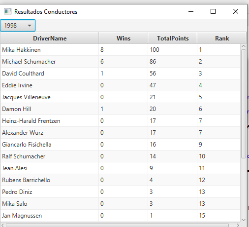
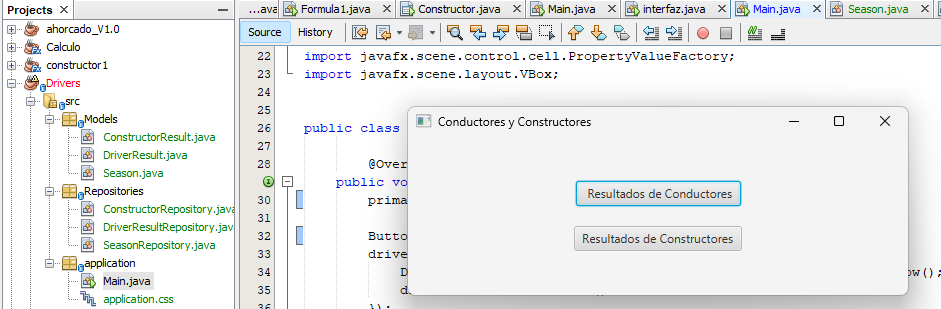

# DRIVERS FORMULA 1

Esta aplicación JavaFX permite visualizar los resultados de los conductores y constructores de Formula 1 en dos `TableView` distintos, basados en los datos obtenidos de una base de datos phpMyAdmin. Los usuarios pueden seleccionar un año específico desde un `ComboBox` y los resultados correspondientes se mostrarán en la tabla correspondiente.

.

## CARACTERISTICA

- Selección entre visualizar resultados de conductores o de constructores.
- Selección de año mediante un `ComboBox`.
- Visualización de resultados en un `TableView` con las siguientes columnas:
- Para conductores: `DriverName`, `Wins`, `TotalPoints`, `Rank`.
## EJECUCION
.

## SE UTILIZO
- Java .
- MySQL.
- Librerías de JavaFX.

## BASE DE DATOS

1. Instala MySql y crea una base de datos en phpMyAdmin  llamada `Proyecto1`.
2. Asegúrate de tener las siguientes tablas y datos en tu base de datos:
    - `drivers`
    - `races`
    - `results`
    - `seasons`
## CONEXION CON LA BASE DE DATOS
Configura las credenciales de la base de datos en las clases `DriverResultRepository`.

    String url="jdbc:mysql://127.0.0.1:3306/proyecto1";
    String usuario="ashley";
    String contrasenia="Ashley/523_5";
    ``` 
## ESTRUCTURA

- `Main.java`: Clase principal que inicia la aplicación y muestra la ventana principal para seleccionar entre conductores y constructores.
- `DriverResultsWindow.java`: Clase que crea la ventana con el `TableView` para mostrar los resultados de los conductores.
- `ConstructorResultsWindow.java`: Clase que crea la ventana con el `TableView` para mostrar los resultados de los constructores.
- `Repositories/DriverResultRepository.java`: Clase que maneja la conexión a la base de datos y las consultas de resultados de los conductores.
- `Repositories/ConstructorRepository.java`: Clase que maneja la conexión a la base de datos y las consultas de resultados de los constructores.
- `Repositories/SeasonRepository.java`: Clase que maneja la conexión a la base de datos y las consultas de temporadas.
- `Models/DriverResult.java`: Clase modelo para los resultados de los conductores.
- `Models/ConstructorResult.java`: Clase modelo para los resultados de los constructores.
- `Models/Season.java`: Clase modelo para las temporadas.
